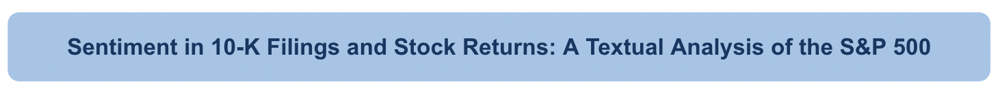

## About Me

My name is Hanah Gordon, and I am currently a rising senior studying Financial Engineering in Lehigh University's IBE Honors Program. The purpose of this website is to showcase coding work I have done on my own and in classes, particularly FIN377 (Applied Data Analytics for Finance in Python).

<!-- Upload your own photo and change the path -->

<!--    -->

---

## Portfolio

  <a href="report/report.html">
    
    
This project examines the relationship between sentiment in 10-K filings and stock returns around the publication date. I constructed three sentiment dictionaries focused on employees, innovation, and reputation, and measured them alongside an existing dictionary of positive and negative words. I then analyzed their correlation with returns using data from the S&P 500.

  </a>

  <h3><a href="report/report.html">Regression Practice</a></h3>
  
Or: The process that created this page can be used to show off your whole midterm analysis file, as is.

  

  <h3><a href="https://donbowen.github.io/teamproject/">Eventual Team Project</a></h3>
  

  <h3><a href="/pdf/sample_presentation.pdf">Some Personal Project</a></h3>
  

---

## Career Objectives

Write what you want. 

Sell yourself!

---

## Hobbies

Maybe include a little about these, especially if they are the kinds of things that work well in interviews.

---

Page template forked from <a href="https://github.com/evanca/quick-portfolio">evanca</a>

