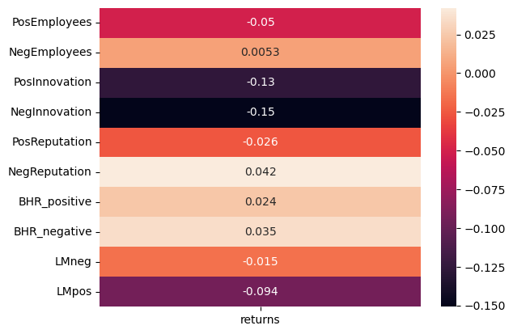
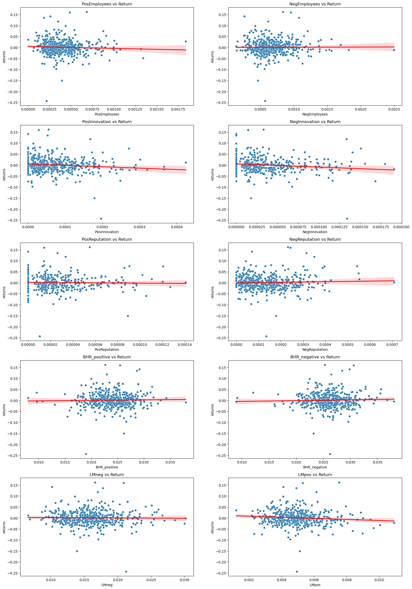

---
layout: wide_default
---  
# Assignment 5 Report

## Summary 

This project examines the relationship between sentiment in 10-K filings and stock returns around the publication date. I constructed three sentiment dictionaries focused on employees, innovation, and reputation which I measured alongside an existing dictionary of positive and negative words. Using a sample of S&P 500 firms, I extracted and cleaned text from 10-K reports, computed 10 sentiment scores, and analyzed their correlation with stock returns. The report below describes and analyzes my findings. 

## Data Section

#### Data Sample: 
The data sample is firms in the S&P500 as of December 28th 2022. The list is acquired from a snapshot of Wikipedia.

#### Building Return Variables: 
1. I downloaded daily stock returns for 2022 from CRSP using a data file in the class [repo](https://github.com/LeDataSciFi/data/blob/main/Stock%20Returns%20(CRSP)/crsp_2022_only.zip). 
2. I read the file using the code below:
``` python
crsp_returns = pd.read_stata('inputs/crsp_2022_only.dta')
```
3. This gave me the ticker number, date, and returns for each firm, which I merged with my existing csv using the code below:

```python
sp500 = (
    sp500.merge(crsp_returns, 
            how='left', 
            left_on=[ 'Symbol', 'filing_date'], 
            right_on=[ 'ticker','date'],
            validate="m:1")
    .rename(columns={'ret':'returns'})
)
```
These steps left me with the returns for each firm on the date that the 10k was published. 

### Sentiment Variables

#### Building the Variables

1. The BHR positive and negative dictionaries simply had to be loaded and converted to lower case in order to create the variables. For example:

```python
with open('inputs/ML_negative_unigram.txt', 'r') as file:
    BHR_negative = [line.strip().lower() for line in file]

BHR_negative.sort()
```
2. Creating the LM positive and negative variables required counting how many times each word in the single set of LM words fell in the positive and negative columns. For example:

```python
file_path = "inputs/LM_MasterDictionary_1993-2021.csv"  # Update with actual path
df = pd.read_csv(file_path)
LM_positive = df[df['Positive'] > 0]['Word'].tolist()
LM_positive = [e.lower() for e in LM_positive] # to be consistent with our BHR input
df.describe() # there are negative numbers in the columns: years the word is removed!
len(LM_positive)
```
3. Additionally, I created dictionaries describing three different topics. To do so, I created my own dictionaries by creating new text files and writing a list of words about employees, innovation, and reputation. To find appropriate words I started with a list produced by ChatGPT. I then eliminated any word that may relate to a topic other than my intended one. When I was unsure, I searched three 10Ks for the word in question and analyzed how it was used. I also added variations of each word (for example: innovate, innovation, etc.). Finally, I loaded my dictionaries by reading the text files:
``` python
with open('inputs/Innovation.txt', 'r') as file:
    Innovation_Words = [line.strip().lower() for line in file]

```
4. To measure firm sentiment, I downloaded their 2022 10K using the `SEC-edgar-downloader` package. I cleaned the HTML using the beautiful soup function. In doing so, I prepared the 10K files to be analyzed for sentiment scores by, for example, eliminating punctuation and making everything lowercase. After cleaning them, I create 10 variables. Four of them measure overall positive and negative sentiment using the BHR and LM dictionaries seperately. The remaining six measure the positive and negative sentiment of employees, innovation, and reputation. For example, the positive sentiment for employees is created by measuring the frequency of LM_positive words near words in my employee dictionary.

The first four were done like this:
```python
sp500.at[index,'LMpos'] = len(re.findall(r'\b('+'|'.join(LM_positive)+r')\b', document))/doc_length

```
The remaining six were done like this:
```python
sp500.at[index,'PosReputation'] = NEAR_finder(Reputation_Words,LM_positive,document)[0]/doc_length
```
5. I began with the 4 given dictionaries and evaluated how often those words appeared in a given 10k and divided that number by the length of the 10k. Next, I evaluated how often each of my sentiment dictionaries appeared near an LM_positive or LM_negative word. Again, I put that number over the length of each 10k.

#### Variable datapoints

Dictionary Lengths
|        Dictionary  | Length |
|-------------------|--------|
|    BHR_positive   |   75   |
|    BHR_negative   |   94   |
|    LM_positive    |  347   |
|     LM_negative   | 2345   |
|     Innovation   | 26   |
|     Reputation   | 44   |
|     Employees   | 27  |

#### My chosen topics
I chose to create variables for innovation, employees, and reputation. I chose these topics by skimming the suggested topics on the assignment description and using my prior knowledge of value creation in a company. Companies must create value for both stakeholders and shareholders. The reputation variable works to analyze market positioning and the resulting potential for sales. This relates to creating value for shareholders. Employees are major stakeholders in any company - hence the employee variable. Finally, without innovation, a company has will fall behind and has no future. I used this variable as a way of analyzing a compnaies ability to continue creating value at an equal or higher level in the future. 

#### Summary Statistics

Below is a quick look at the variables and returns in my final dataset. 


```python
import pandas as pd
analysis_sample = pd.read_csv("output/analysis_sample.csv")
analysis_sample[['PosEmployees', 'NegEmployees', 'PosInnovation', 'NegInnovation', 'PosReputation', 
             'NegReputation', 'BHR_positive', 'BHR_negative', 'LMneg', 'LMpos', 'returns']]
```


<div>
<style scoped>
    .dataframe tbody tr th:only-of-type {
        vertical-align: middle;
    }

    .dataframe tbody tr th {
        vertical-align: top;
    }

    .dataframe thead th {
        text-align: right;
    }
</style>
<table border="1" class="dataframe">
  <thead>
    <tr style="text-align: right;">
      <th></th>
      <th>PosEmployees</th>
      <th>NegEmployees</th>
      <th>PosInnovation</th>
      <th>NegInnovation</th>
      <th>PosReputation</th>
      <th>NegReputation</th>
      <th>BHR_positive</th>
      <th>BHR_negative</th>
      <th>LMneg</th>
      <th>LMpos</th>
      <th>returns</th>
    </tr>
  </thead>
  <tbody>
    <tr>
      <th>0</th>
      <td>0.000196</td>
      <td>0.000497</td>
      <td>0.000026</td>
      <td>0.000026</td>
      <td>0.000000</td>
      <td>0.000039</td>
      <td>0.025683</td>
      <td>0.031662</td>
      <td>0.023249</td>
      <td>0.003977</td>
      <td>0.007573</td>
    </tr>
    <tr>
      <th>1</th>
      <td>0.000177</td>
      <td>0.000503</td>
      <td>0.000059</td>
      <td>0.000000</td>
      <td>0.000000</td>
      <td>0.000059</td>
      <td>0.024460</td>
      <td>0.023602</td>
      <td>0.012984</td>
      <td>0.003756</td>
      <td>-0.012737</td>
    </tr>
    <tr>
      <th>2</th>
      <td>0.000250</td>
      <td>0.000557</td>
      <td>0.000096</td>
      <td>0.000019</td>
      <td>0.000000</td>
      <td>0.000019</td>
      <td>0.021590</td>
      <td>0.024394</td>
      <td>0.012793</td>
      <td>0.003726</td>
      <td>-0.031431</td>
    </tr>
    <tr>
      <th>3</th>
      <td>0.000374</td>
      <td>0.000309</td>
      <td>0.000065</td>
      <td>0.000065</td>
      <td>0.000000</td>
      <td>0.000000</td>
      <td>0.019753</td>
      <td>0.022645</td>
      <td>0.015448</td>
      <td>0.006481</td>
      <td>-0.006484</td>
    </tr>
    <tr>
      <th>4</th>
      <td>0.000789</td>
      <td>0.001001</td>
      <td>0.000366</td>
      <td>0.000096</td>
      <td>0.000019</td>
      <td>0.000269</td>
      <td>0.027968</td>
      <td>0.023964</td>
      <td>0.016861</td>
      <td>0.008642</td>
      <td>-0.007076</td>
    </tr>
    <tr>
      <th>...</th>
      <td>...</td>
      <td>...</td>
      <td>...</td>
      <td>...</td>
      <td>...</td>
      <td>...</td>
      <td>...</td>
      <td>...</td>
      <td>...</td>
      <td>...</td>
      <td>...</td>
    </tr>
    <tr>
      <th>498</th>
      <td>0.000406</td>
      <td>0.000781</td>
      <td>0.000062</td>
      <td>0.000047</td>
      <td>0.000094</td>
      <td>0.000219</td>
      <td>0.026854</td>
      <td>0.027307</td>
      <td>0.015997</td>
      <td>0.004718</td>
      <td>-0.019989</td>
    </tr>
    <tr>
      <th>499</th>
      <td>0.000639</td>
      <td>0.000468</td>
      <td>0.000128</td>
      <td>0.000064</td>
      <td>0.000043</td>
      <td>0.000319</td>
      <td>0.028396</td>
      <td>0.026842</td>
      <td>0.014964</td>
      <td>0.006258</td>
      <td>-0.077843</td>
    </tr>
    <tr>
      <th>500</th>
      <td>0.000262</td>
      <td>0.001032</td>
      <td>0.000077</td>
      <td>0.000000</td>
      <td>0.000031</td>
      <td>0.000108</td>
      <td>0.021506</td>
      <td>0.026759</td>
      <td>0.021783</td>
      <td>0.004591</td>
      <td>0.026077</td>
    </tr>
    <tr>
      <th>501</th>
      <td>0.000342</td>
      <td>0.000527</td>
      <td>0.000000</td>
      <td>0.000029</td>
      <td>0.000000</td>
      <td>0.000057</td>
      <td>0.019965</td>
      <td>0.023898</td>
      <td>0.014992</td>
      <td>0.003962</td>
      <td>0.060027</td>
    </tr>
    <tr>
      <th>502</th>
      <td>0.000293</td>
      <td>0.000803</td>
      <td>0.000077</td>
      <td>0.000128</td>
      <td>0.000000</td>
      <td>0.000255</td>
      <td>0.021790</td>
      <td>0.033508</td>
      <td>0.019980</td>
      <td>0.005036</td>
      <td>0.006771</td>
    </tr>
  </tbody>
</table>
<p>503 rows × 11 columns</p>
</div>


Summary statistics for each of my ten variables can be seen below. The table was created using the .describe() function. 


```python
analysis_sample[['PosEmployees', 'NegEmployees', 'PosInnovation', 'NegInnovation', 'PosReputation', 
             'NegReputation', 'BHR_positive', 'BHR_negative', 'LMneg', 'LMpos', 'returns']].describe()
```


<div>
<style scoped>
    .dataframe tbody tr th:only-of-type {
        vertical-align: middle;
    }

    .dataframe tbody tr th {
        vertical-align: top;
    }

    .dataframe thead th {
        text-align: right;
    }
</style>
<table border="1" class="dataframe">
  <thead>
    <tr style="text-align: right;">
      <th></th>
      <th>PosEmployees</th>
      <th>NegEmployees</th>
      <th>PosInnovation</th>
      <th>NegInnovation</th>
      <th>PosReputation</th>
      <th>NegReputation</th>
      <th>BHR_positive</th>
      <th>BHR_negative</th>
      <th>LMneg</th>
      <th>LMpos</th>
      <th>returns</th>
    </tr>
  </thead>
  <tbody>
    <tr>
      <th>count</th>
      <td>501.000000</td>
      <td>501.000000</td>
      <td>501.000000</td>
      <td>501.000000</td>
      <td>501.000000</td>
      <td>501.000000</td>
      <td>501.000000</td>
      <td>501.000000</td>
      <td>501.000000</td>
      <td>501.000000</td>
      <td>492.000000</td>
    </tr>
    <tr>
      <th>mean</th>
      <td>0.000389</td>
      <td>0.000675</td>
      <td>0.000070</td>
      <td>0.000032</td>
      <td>0.000021</td>
      <td>0.000137</td>
      <td>0.023948</td>
      <td>0.025892</td>
      <td>0.015906</td>
      <td>0.004986</td>
      <td>0.000911</td>
    </tr>
    <tr>
      <th>std</th>
      <td>0.000202</td>
      <td>0.000264</td>
      <td>0.000067</td>
      <td>0.000035</td>
      <td>0.000026</td>
      <td>0.000104</td>
      <td>0.003489</td>
      <td>0.003392</td>
      <td>0.003691</td>
      <td>0.001315</td>
      <td>0.034349</td>
    </tr>
    <tr>
      <th>min</th>
      <td>0.000000</td>
      <td>0.000141</td>
      <td>0.000000</td>
      <td>0.000000</td>
      <td>0.000000</td>
      <td>0.000000</td>
      <td>0.007966</td>
      <td>0.008953</td>
      <td>0.006609</td>
      <td>0.001226</td>
      <td>-0.242779</td>
    </tr>
    <tr>
      <th>25%</th>
      <td>0.000254</td>
      <td>0.000503</td>
      <td>0.000018</td>
      <td>0.000000</td>
      <td>0.000000</td>
      <td>0.000055</td>
      <td>0.021971</td>
      <td>0.023964</td>
      <td>0.013296</td>
      <td>0.004095</td>
      <td>-0.016449</td>
    </tr>
    <tr>
      <th>50%</th>
      <td>0.000346</td>
      <td>0.000631</td>
      <td>0.000055</td>
      <td>0.000022</td>
      <td>0.000014</td>
      <td>0.000115</td>
      <td>0.024117</td>
      <td>0.025899</td>
      <td>0.015646</td>
      <td>0.004895</td>
      <td>-0.001360</td>
    </tr>
    <tr>
      <th>75%</th>
      <td>0.000479</td>
      <td>0.000803</td>
      <td>0.000100</td>
      <td>0.000047</td>
      <td>0.000031</td>
      <td>0.000197</td>
      <td>0.026129</td>
      <td>0.027808</td>
      <td>0.017859</td>
      <td>0.005656</td>
      <td>0.015979</td>
    </tr>
    <tr>
      <th>max</th>
      <td>0.001841</td>
      <td>0.002496</td>
      <td>0.000424</td>
      <td>0.000191</td>
      <td>0.000141</td>
      <td>0.000709</td>
      <td>0.037982</td>
      <td>0.038030</td>
      <td>0.030185</td>
      <td>0.010899</td>
      <td>0.162141</td>
    </tr>
  </tbody>
</table>
</div>


All variables have a positive, non-zero mean and standard deviation. This indicates that all variables have a measurable, although small, presence in the data. More specifically, these values measure the sentiment score divided by the total length of the document. This means that each variable has a measurable sentiment which represents a small and variable (because of the non-zero standard deviation) percent of the document. 

The returns for firms on the 10k filing date are 0.000911 on average and range from -0.242779 to 0.162141. The variable with the highest precense was BHR_negative with a mean of 0.025892. 	

#### Smell Test
My dataset passes the smell test. All of my variables have a majority of non-zero values amongst the 500 companies and there is noticeable variation of scores among and within each variable. However, my outputs could be improved by enhancing my dictionaries so that no outputs of zero are produced. 

## Results

To understand how 10K sentiment is related to returns, the next figure shows correlations. Noteably, this shows that negative innovation has the strongest (although negative) correlation and negative reputation has the highest positive correlation. 


```python
import matplotlib.pyplot as plt
import seaborn as sns
import numpy as np

corr_table = analysis_sample[['PosEmployees', 'NegEmployees', 'PosInnovation', 'NegInnovation', 'PosReputation', 
             'NegReputation', 'BHR_positive', 'BHR_negative', 'LMneg', 'LMpos', 'returns']].corr()
corr_table = corr_table.loc[['PosEmployees', 'NegEmployees', 'PosInnovation', 'NegInnovation', 'PosReputation', 
             'NegReputation', 'BHR_positive', 'BHR_negative', 'LMneg', 'LMpos'], ['returns']]
sns.heatmap(corr_table, annot=True)
corr_table
```


<div>
<style scoped>
    .dataframe tbody tr th:only-of-type {
        vertical-align: middle;
    }

    .dataframe tbody tr th {
        vertical-align: top;
    }

    .dataframe thead th {
        text-align: right;
    }
</style>
<table border="1" class="dataframe">
  <thead>
    <tr style="text-align: right;">
      <th></th>
      <th>returns</th>
    </tr>
  </thead>
  <tbody>
    <tr>
      <th>PosEmployees</th>
      <td>-0.050028</td>
    </tr>
    <tr>
      <th>NegEmployees</th>
      <td>0.005285</td>
    </tr>
    <tr>
      <th>PosInnovation</th>
      <td>-0.126626</td>
    </tr>
    <tr>
      <th>NegInnovation</th>
      <td>-0.150850</td>
    </tr>
    <tr>
      <th>PosReputation</th>
      <td>-0.025980</td>
    </tr>
    <tr>
      <th>NegReputation</th>
      <td>0.042176</td>
    </tr>
    <tr>
      <th>BHR_positive</th>
      <td>0.023518</td>
    </tr>
    <tr>
      <th>BHR_negative</th>
      <td>0.034847</td>
    </tr>
    <tr>
      <th>LMneg</th>
      <td>-0.015421</td>
    </tr>
    <tr>
      <th>LMpos</th>
      <td>-0.093838</td>
    </tr>
  </tbody>
</table>
</div>


    

    


```python
variables = ['PosEmployees', 'NegEmployees', 'PosInnovation', 'NegInnovation', 'PosReputation', 
             'NegReputation', 'BHR_positive', 'BHR_negative', 'LMneg', 'LMpos']

fig, axes = plt.subplots(5, 2, figsize=(20, 30))

axes = axes.flatten()

for i, var in enumerate(variables):
    sns.scatterplot(data=analysis_sample, x=var, y='returns', ax=axes[i])
    axes[i].set_title(f"{var} vs Return")
    sns.regplot(data=analysis_sample, x=var, y='returns', ax = axes[i], scatter= False, color='red')
```


    

    


## Discussion

1) Both the LM positive and LM negative variables have a negative correlation with returns. Because I only have one return data point for each compay, this indicates that a higher presense of these sentiments is correlated with a negative return value. BHR negative and positive variables both have a positive correlation with return. Interestly, both LM variables have a stronger correlation value than either BHR variable.

3) As seen in the scatter plots above, my contextual sentiment variables do not have a strong correlation to returns. However, I do believe the correlations are different enough from zero to be worth investigating. It is worth noting that I only downloaded returns on the day of 10K publishing for each company. It would be interesting to see if correlation between my variables and returns increased as time since publication of the 10K increased. As I described above, employees, reputation, and innovation are three extremely important facets of any company, so I believe a more highly refined approach would yeild a clearer correlation with returns. 


```python

```
